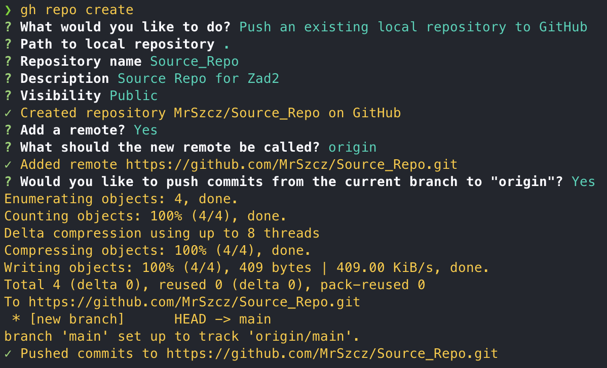
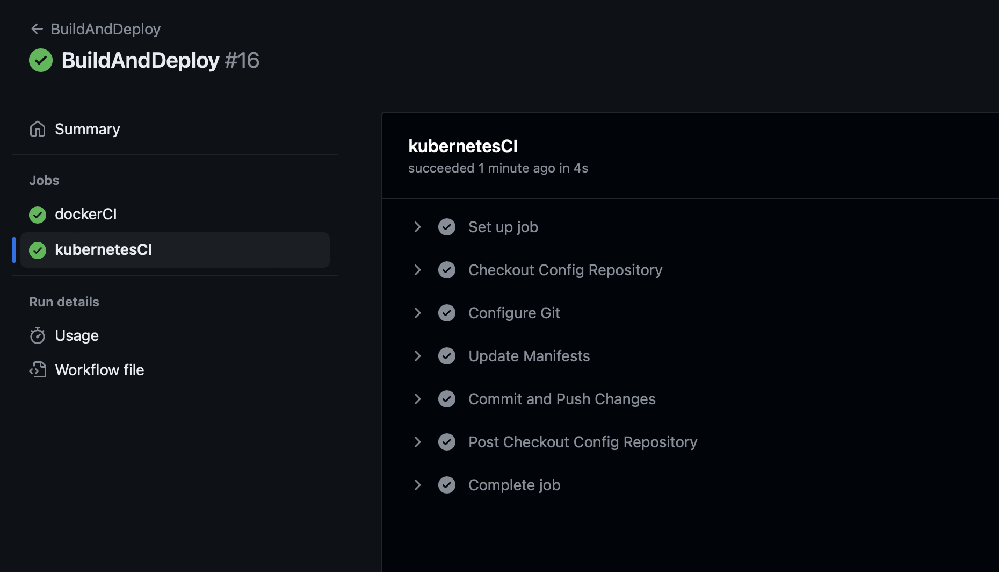

# Zadanie 2 (Lab 10)

## Linki

- [x]  [Repozytorium "Source"](https://github.com/MrSzcz/Source_Repo)
- [x]  [Repozytorium "Config"](https://github.com/MrSzcz/Config_Repo)
- [x]  [DockerHub z obrazami "WebApp" oraz "zad2gitops](https://hub.docker.com/u/mrszcz)

## Krok 0

- Konfiguracja GitHub CLI


- Utworzenie tokenu na DockerHub


- Utworzenie PAT (Personal Access Token) na GitHub


- Dodanie "Secrets"


## Krok 1

W tym kroku utworzono repozytoria "Source" oraz "Config"

### 1.A

W repozytorium "Source" znajdują się następujące pliki:

- [index.html](https://github.com/MrSzcz/Source_Repo/blob/main/index.html) - Zawiera prostą stronę wyświetlającą imię, nazwisko oraz wersję aplikacji
```
<html>
<head>
<title>Zad2</title>
</head>
<body>
<p>Kacper Szczepaniuk</p>
<p>Wersja: 0.1</p>
</body>
</html>
```
- [Dockerfile](https://github.com/MrSzcz/Source_Repo/blob/main/Dockerfile) - Uruchamia serwer nginx oraz podmienia stronę index.html
```
FROM nginx:latest
COPY ./index.html /usr/share/nginx/html/index.html
```
- [zad2lab10.yml](https://github.com/MrSzcz/Source_Repo/blob/main/.github/workflows/zad2lab10.yml) - Zawiera konfigurację akcji przeprowadzanych przez Github Actions - więcej w sekcji "Krok 2"

Po utworzeniu plików zostało zainicjowane repozytorium i przy użyciu GitHub CLI wysłane na platformę:




### 1.B

W repozytorium "Config" znajdują się następujące pliki:

- [deployment.yaml](https://github.com/MrSzcz/Config_Repo/blob/main/deployment.yaml) - Zawiera konfigurację Deployment'u. Zostały zdefiniowane 4ry repliki z procedurą aktualizacji: maxSurge: 1 = maksymalna ilość jednoczesnych replik przy aktualizacji będzie wynosić 5 (4+1); maxUnavailable: 2 = minimalna ilość niedostępnych replik będzie wynosić 2 (4-2). Dodatkowo linijka image: mrszcz/webapp:.. będzie modyfikowana w ramach workflow.
```
apiVersion: apps/v1
kind: Deployment
metadata:
  name: my-app-deployment
spec:
  replicas: 4
  selector:
    matchLabels:
      app: my-app
  template:
    metadata:
      labels:
        app: my-app
    spec:
      containers:
      - name: my-app-container
        image: mrszcz/webapp:1.2
  strategy:
    type: RollingUpdate
    rollingUpdate:
      maxSurge: 1
      maxUnavailable: 2
```

- [ingress.yaml](https://github.com/MrSzcz/Config_Repo/blob/main/ingress.yaml) - Zawiera konfigurację obiektu Ingress.
```
apiVersion: networking.k8s.io/v1
kind: Ingress
metadata:
  name: my-app-ingress
spec:
  rules:
  - host: zad2.lab
    http:
      paths:
      - path: /
        pathType: Prefix
        backend:
          service:
            name: my-app-service
            port:
              number: 80
```

- [service.yaml](https://github.com/MrSzcz/Config_Repo/blob/main/service.yaml) - Zawiera konfigurację obiektu Service.
```
apiVersion: v1
kind: Service
metadata:
  name: my-app-service
spec:
  selector:
    app: my-app
  ports:
    - protocol: TCP
      port: 80
      targetPort: 80
  type: NodePort
```

Po utworzeniu plików zostało zainicjowane repozytorium i przy użyciu GitHub CLI wysłane na platformę:


## Krok 2

W tym kroku utworzono plik "zad2lab10.yml" znajdujący się w repozytorium "Source".

### 2.A i 2.B

Kod pliku [zad2lab10.yml](https://github.com/MrSzcz/Source_Repo/blob/main/.github/workflows/zad2lab10.yml)

```
name: BuildAndDeploy

on:
  workflow_dispatch:
    inputs:
      tag:
        description: 'Tag for Docker Image'
        required: true
        type: string
        default: 'latest'

jobs:
  dockerCI:
    runs-on: ubuntu-latest
    steps:
      - name: Checkout Repository
        uses: actions/checkout@v4

      - name: Set up QEMU
        uses: docker/setup-qemu-action@v3

      - name: Set up Docker Buildx
        uses: docker/setup-buildx-action@v3

      - name: Login to DockerHub
        uses: docker/login-action@v3
        with:
          username: ${{ secrets.DOCKERHUB_USERNAME }}
          password: ${{ secrets.DOCKERHUB_TOKEN }}

      - name: Build and Push Docker Image
        uses: docker/build-push-action@v5
        with:
          context: .
          file: ./Dockerfile
          platforms: linux/amd64,linux/arm64
          push: true
          tags: |
            mrszcz/webapp:latest
            mrszcz/webapp:${{ inputs.tag }}

  kubernetesCI:
    runs-on: ubuntu-latest
    needs: dockerCI
    steps:
      - name: Checkout Config Repository
        uses: actions/checkout@v4
        with:
          repository: MrSzcz/Config_Repo
          token: ${{ secrets.OwnToken }}

      - name: Configure Git
        run: |
          git config user.email "kacper.szczepaniuk@pollub.edu.pl"
          git config user.name "mrszcz"

      - name: Update Manifests
        run: |
          sed -i "s/webapp:.*/webapp:${{ inputs.tag }}/g" deployment.yaml

      - name: Commit and Push Changes
        run: |
          git add .
          git commit -m "Update image reference"
          git push
```

Akcja o nazwie "BuildAndDeploy" wymaga od użytkownika ręcznego uruchomienia całego procesu (workflow_dispatch). Użytkownik może podać jako argument tag, który posłuży jako tag w procesie budowania obrazu Docker, jak również wartość ta zostanie podmieniona w pliku deployment.yaml, aby CronJob korzystał z ostatnio wygenerowanego obrazu. Jeśli użytkownik nie poda tej wartości, to domyślnie ustawi się "latest", a więc wygenerowany zostanie jeden obraz Docker. Akcja ta posiada zdefiniowane dwa zadania, które korzystają z najnowszej wersji systemu Ubuntu:

1. dockerCI - służy do zbudowania obrazu Docker oraz przesłania go do DockerHub (push: true). Logowanie do tej usługi następuje poprzez ukryte, wcześniej zdefiniowane wartości (secrets) ( ${{ secrets.nazwaklucza }} ). Zbudowany obraz jest wysyłany pod dwoma tagami: latest (jako najnowszy obraz) oraz - jeśli użytkownik zdefiniuje tag - pod danym tagiem.

2. kubernetesCI - służy do aktualizacji tagu obrazu w pliku deployment.yaml, w repozytorium "Config". Na początku następuje skojarzenie z odpowiednim repozytorium poprzez with: repository (ponieważ znajdujemy się obecnie w repozytorium "Source") oraz ustawienie PAT (Personal Access Token), aby mieć uprawnienia do aktualizacji plików w tym repozytorium. Podmienienie wartości dokonuje się poprzez program "sed", który znajduje napis "webapp:jakistag" i podmienia go na odpowiedni tag (zdefiniowany przez użytkownika lub domyślny "latest").

Po wysłaniu pliku do zdalnego repozytorium, możemy znaleźć zdefiniowaną akcję w sekcji "Actions":


Uruchomienie Workflow


## Krok 3

W tym kroku utworzono Dockerfile oraz manifest obiektu CronJob, który to wykorzystuje ten obraz.

### 3.A

Utworzony Dockerfile:

```
FROM alpine:latest

RUN apk --no-cache add git curl

RUN curl -LO "https://storage.googleapis.com/kubernetes-release/release/$(curl -s https://storage.googleapis.com/kubernetes-release/release/stable.txt)/bin/linux/amd64/kubectl" && \
    chmod +x ./kubectl && \
    mv ./kubectl /usr/local/bin/kubectl

LABEL maintainer="Kacper Szczepaniuk <kacper.szczepaniuk@pollub.edu.pl>"

WORKDIR /app

CMD ["/bin/sh"]
```

Wykorzystuje on najnowszy obraz Alpine. Instaluje następnie wymagane narzędzia, czyli git, curl oraz kubectl.

Tak utworzony Dockerfile został następnie zbudowany oraz wysłany na platformę [DockerHub](https://hub.docker.com/r/mrszcz/zad2gitops).

- Zbudowanie:


- Wysłanie


- Sprawdzenie


### 3.B

Manifest obiektu CronJob:

```
apiVersion: batch/v1
kind: CronJob
metadata:
  name: stepcd
spec:
  schedule: "*/2 * * * *"
  concurrencyPolicy: Forbid
  jobTemplate:
    spec:
      backoffLimit: 0
      template:
        spec:
          restartPolicy: Never
          serviceAccountName: gitops
          containers:
            - name: zad2gitops 
              image: mrszcz/zad2gitops:latest
              command: [sh, -e, -c]
              args:
                - git clone https://github.com/MrSzcz/Config_Repo.git /tmp/config_repo && find /tmp/config_repo -name "*.yaml" -exec kubectl apply -f {} \;
```

Konfiguracja ta zawiera w sobie odniesienie do obrazu wysłanego do DockerHub w kroku 3.A oraz odpowiednie ścieżki do repozytorium "Config".

- Wywołanie wymaganych komend:


- Uruchomienie CronJob


## Krok 4

W tym kroku nastąpiło sprawdzenie działania wykonanych zadań

### 4.A

Aby aplikacja webowa była dostępna pod adresem ```http://zad2.lab``` należało wykonać następujące kroki:

1. Sprawdzić ip minikube:


2. Ustawić mapowanie w pliku hosts:


3. Uruchomić tunel minikube:


Po wykonaniu tych akcji została sprawdzona strona www:


### 4.B

Zostały wykonane następujące czynności:

1. Zmiana wersji w pliku index.html na "1.2"


2. Zatwierdzenie zmian i push


3. Ponowne uruchomienie akcji Workflow z tagiem "1.2"


4. Sprawdzenie graficzne procesu w zakładce Actions


5. Sprawdzenie pliku deployment.yaml w repozytorium "Config"


6. Sprawdzenie obrazu na DockerHub


7. Odświeżenie strony - po krótkim czasie wskazywała poprawną wersję

